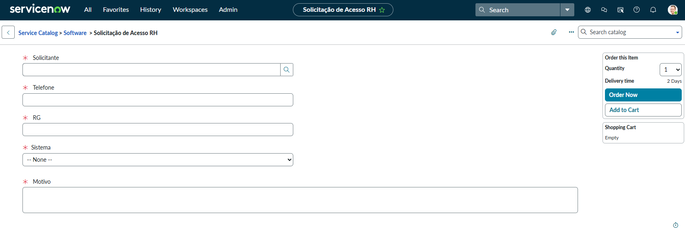

# 📘 Lab 01: Formulário de Solicitação de Acesso RH

## 🎯 Objetivo Técnico
Demonstrar a aplicação do princípio DRY (Don't Repeat Yourself) na construção de **Catalog Items** no ServiceNow. O laboratório foca em gerar a hierarquia de *Request Fulfillment* padrão (REQ > RITM > SCTASK) injetando um **Variable Set** reutilizável para coletar dados repetitivos.

## 🏢 O Cenário (Business Case na Nebula)
A Nebula Cloud Dynamics percebeu que, a cada novo *Onboarding* no RH, os funcionários preenchiam os mesmos dados (Nome, Telefone, RG) em sistemas descentralizados. Como Engenheiro de Soluções, fui encarregado de criar um Item de Catálogo único e inteligente, forçando a seleção de sistemas ERP/CRM corporativos.

## 💡 Decisões Arquiteturais e Execução

1. **A Adoção do Catalog Item:** 
   * Os critérios de negócio estipulavam que "O formulário deverá gerar uma RITM". Foi descartado o uso do *Record Producer* (que cria tarefas isoladas na tabela Incident/Task). Garantimos o processo nativo através do componente Catalog Item.

2. **O Poder do Variable Set:**
   * **Governança de Dados:** Variáveis como "Nome", "RG" e "Telefone" foram encapsuladas num *Single-Row Variable Set* (`Informacoes_do_Funcionario`). A grande vantagem é que qualquer formulário futuro pode importar esse bloco, garantindo padronização e economizando horas de desenvolvimento.

3. **Validação Estrita:**
   * Todas as variáveis foram marcadas como `Mandatory: True`. A variável `Sistema` (Select Box) foi configurada com a propriedade "Include None" para forçar que o usuário selecione ativamente uma opção, evitando dados lixo.

## 📸 Evidências do Laboratório Prático

> O portal da Nebula demonstra o *Variable Set* em ação e a obrigatoriedade dos campos para submissão.

