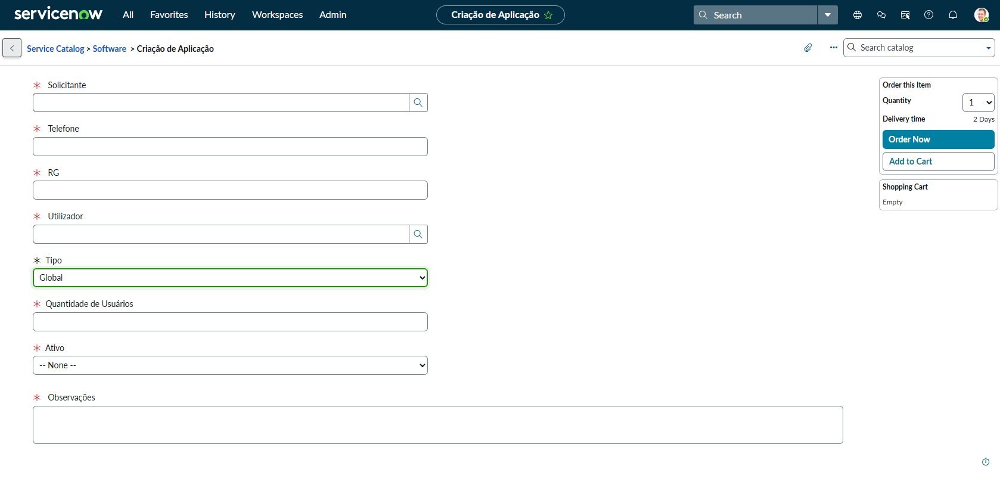
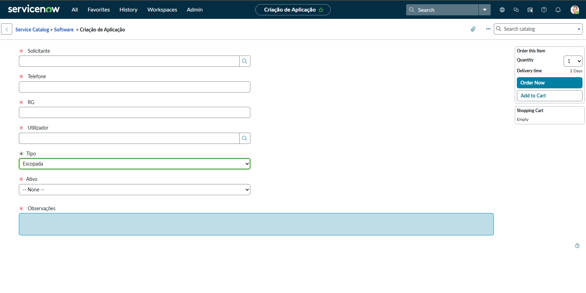

# 📘 Lab 02: Formulário de Criação de Aplicação (UX Dinâmico)

## 🎯 Objetivo Técnico
Implementar formulários inteligentes e reativos na plataforma ServiceNow. O objetivo é dominar as **Catalog UI Policies** no lado do cliente (*Client-Side*) para alterar a visibilidade de campos dinamicamente, garantindo uma interface limpa (Clean UI) baseada nas escolhas do usuário.

## 🏢 O Cenário (Business Case)
O time de *Core IT* da Nebula solicitou uma esteira no Catálogo de Serviços para iniciar aplicações. O problema: o formulário exigia informações diferentes dependendo se a arquitetura solicitada era "Global" ou "Scoped". A nossa missão como Arquitetos foi criar uma interface responsiva sem sacrificar o tempo de carregamento da página.

## 💡 Decisões Arquiteturais e Execução

1. **Arquitetura Front-end (Catalog UI Policies):** 
   * **A Lógica:** Para ocultar a variável `Quantidade de Usuários` dependendo da arquitetura escolhida, a engenharia da ServiceNow recomenda o uso de UI Policies em vez de *Catalog Client Scripts* (On Change).
   * **Por quê?** Catalog UI Policies rodam mais rápido e requerem zero código, garantindo escalabilidade e facilidade de manutenção futura.
   * **Implementação:**
     * Regra 1: `Se Tipo == Global` → `Quantidade de Usuários` e `Ativa` se tornam visíveis e obrigatórios.
     * Regra 2: `Se Tipo == Escopada` → Apenas a variável `Ativa` fica visível.

2. **Reutilização do Motor de Variáveis:**
   * Assim como no Lab 1 de RH, aplicamos a regra DRY injetando o *Variable Set* `Informacoes_do_Funcionario`.

## 📸 Evidências do Laboratório Prático

> Demonstração da ação do motor de regras no *Client-Side*: observe como os campos reagem à escolha "Global" vs "Escopada".

