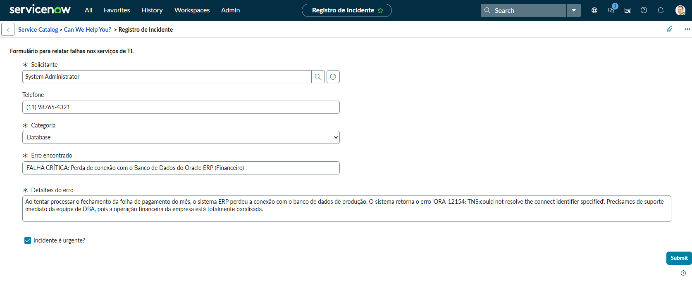
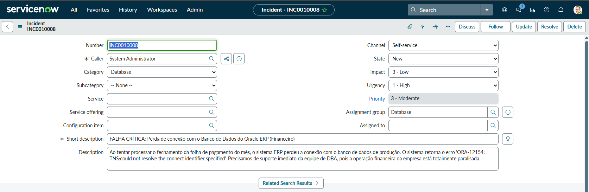

# 📘 Lab 03: Record Producer e Lógica Server-Side (Incident Management)

## 🎯 Objetivo Técnico
Demonstrar domínio sobre a arquitetura de **Record Producers** no ServiceNow, empregando o mapeamento direto de variáveis (Map to Field) e scripts de servidor (`current` vs `producer`) para aplicar regras de negócios no momento da submissão de chamados.

## 🏢 O Desafio de Negócio
A área de suporte da Nebula relatou que os usuários estavam com dificuldade de usar a interface nativa do ServiceNow para abrir incidentes. Foi solicitado um formulário simplificado no *Service Portal*. 
**Requisitos Críticos:** O formulário precisava criar um registro direto na tabela de Incidentes (não uma RITM), classificar automaticamente chamados urgentes e rotear incidentes da categoria "Database" diretamente para o grupo solucionador, sem intervenção humana.

## 💡 Decisões Arquiteturais e Execução (Visão de Engenheiro)

1. **Record Producer vs Catalog Item:** 
   * **Decisão:** Como o objetivo final era povoar a tabela `incident` em vez de gerar um item de requisição (`sc_req_item`), a escolha obrigatória foi o **Record Producer**. Isso preserva a governança ITIL de Gestão de Incidentes.
   
2. **Mapeamento Declarativo (Map to Field):**
   * Em vez de usar scripts pesados, apliquei o recurso nativo *Map to Field* nas variáveis "Solicitante", "Categoria", "Erro" e "Detalhes", conectando-as diretamente às colunas do banco de dados (ex: `caller_id`, `short_description`).

3. **Automação via Server-Side Scripting:**
   * Utilizei a aba de *Script* do Record Producer para manipular os objetos `current` (o registro que será inserido na tabela pai) e `producer` (os dados originados das variáveis do portal).
   * **Lógicas implementadas:**
     * Definição estática de `current.contact_type = 'self-service'`.
     * Motor condicional de priorização (`current.urgency = 1`) atrelado a uma variável *Checkbox*.
     * Roteamento automático de *Assignment Group* via script ao detectar a categoria Database.

## 💻 Código Fonte (Server-Side Script)
Abaixo está o script estruturado na aba de propriedades do *Record Producer*, documentado com as justificativas arquiteturais do negócio:

```javascript
// [ARQUITETURA DE DADOS] Definimos o canal de origem do chamado automaticamente.
// Por que fizemos assim? Para garantir que todo incidente aberto via portal seja 
// categorizado de forma padronizada como 'self-service', independentemente de quem abriu.
current.contact_type = 'self-service';

// [REGRA DE NEGÓCIO CONDICIONAL - URGÊNCIA] Verificamos se a variável de checkbox foi marcada.
// Por que fizemos assim? O usuário final não deve alterar pesos de prioridade livremente, 
// mas se ele sinalizar que é urgente, o script manipula o campo de nível de negócio 'urgency' para 1 (High).
if (producer.incidente_urgente == 'true') {
    current.urgency = 1; 
}

// [ROTEAMENTO AUTOMÁTICO DE GRUPO] Verificamos se a categoria escolhida foi 'database'.
// Por que fizemos assim? Aplicamos o princípio de direcionamento automático de carga de trabalho. 
// O método setDisplayValue('Database') busca de forma segura o sys_id correspondente ao grupo 
// sem que o desenvolvedor precise hardcodar o ID interno da instância.
if (producer.categoria == 'database') {
    current.assignment_group.setDisplayValue('Database');
}

## 📸 Evidências do Laboratório Prático

> Os testes abaixo comprovam a submissão via portal e a perfeita tradução das regras de negócio pelo script do servidor diretamente na tabela de Incidentes.

**Formulário Dinâmico no Portal:**


**Resultado (Incidente Criado com Atribuição Automática):**

