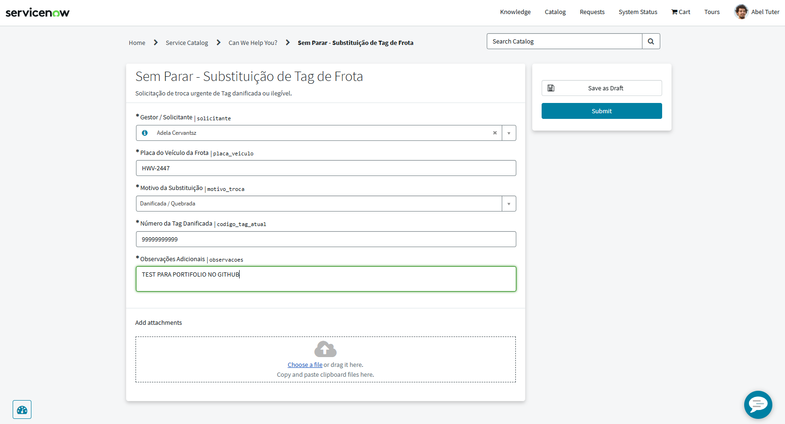
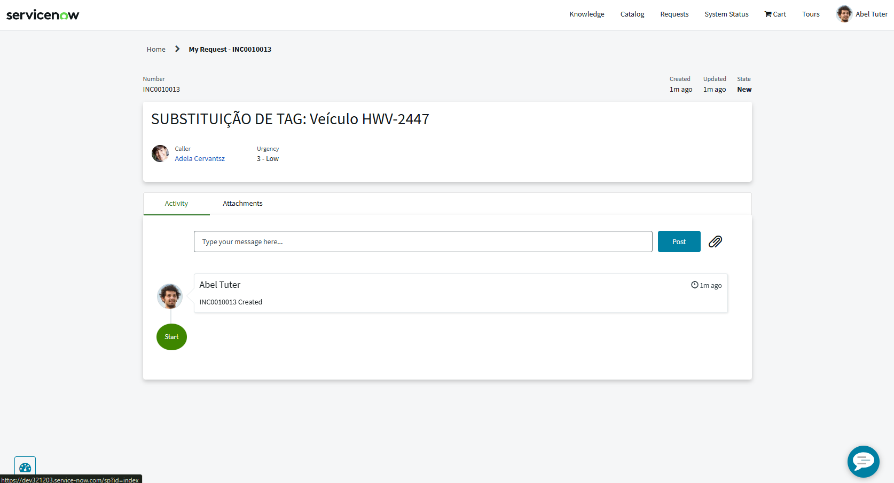

# 📘 Lab 01: Service Portal & Substituição de Tag de Frota (Sem Parar)

## 🎯 Objetivo Técnico
Demonstrar o domínio no desenvolvimento de formulários *Low-Code* no **Service Portal**, utilizando **Record Producers**, regras declarativas de front-end (**Catalog UI Policies**) e lógicas de negócios no servidor para automação de ITSM.

## 🏢 Cenário de Negócio
A equipe de operações do Sem Parar Corpay identificou que gestores de frotas corporativas abriam chamados de reposição de tags sem padronização, gerando atrasos e possíveis prejuízos. A diretoria solicitou um portal de autoatendimento capaz de gerar o incidente diretamente, categorizá-lo e aplicar inteligência de prioridade.

## 💡 Decisões Arquiteturais e Execução (Visão de Engenheiro)

1. **Governança de Release:** 
   * Todo o desenvolvimento foi encapsulado e versionado dentro do Update Set `SemParar_ServicePortal_TagReplacement_v1`, garantindo conformidade para futuras migrações de ambiente (Dev > QA > Prod).

2. **Mapeamento Declarativo (No-Code):**
   * O uso de variáveis conectadas diretamente pelo recurso `Map to field` (como a variável *Gestor* apontando para `caller_id` e *Observações* para `description`) evitou scripts redundantes e aumentou a manutenibilidade do formulário.

3. **UX Responsiva (Catalog UI Policy):**
   * Aplicada uma regra declarativa no *Client-Side* exigindo o preenchimento obrigatório do campo `codigo_tag_atual` exclusivamente quando o motivo da troca for "Danificada / Quebrada".

## 💻 Código Fonte (Server-Side Script)
Para tratar exceções críticas como o roubo de dispositivos de pedágio, implementei um interceptador *Server-Side* na submissão do formulário.

```javascript
// Atribui o tipo de contato como Self-Service
current.contact_type = 'self-service';
current.category = 'infrastucture';

// Monta o resumo formatado para a fila de triagem da equipe do Sem Parar
current.short_description = 'SUBSTITUIÇÃO DE TAG: Veículo ' + producer.placa_veiculo;

// Motor de criticidade: Se o motivo for roubo, eleva a prioridade para bloqueio imediato
if (producer.motivo_troca == 'roubo') {
    current.urgency = 1; // High
    current.impact = 2;  // Medium
}
````
📸 Evidências do Laboratório Prático
Os testes na PDI comprovam o layout do portal respondendo às UI Policies e o back-end processando a categorização e urgência mapeadas via script.
## 📸 Evidências do Laboratório Prático

> Formulário no Service Portal (Validação Declarativa Ativa):



> Incidente Resultante (Automação de Prioridade e Categorização):


