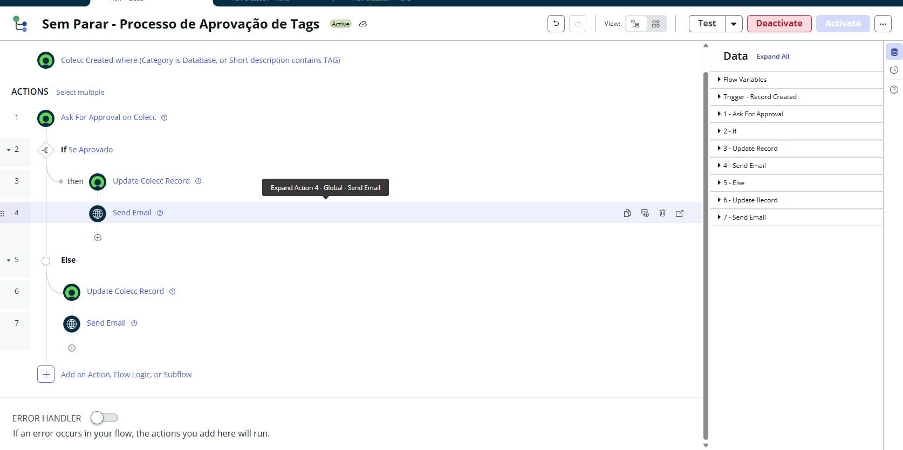
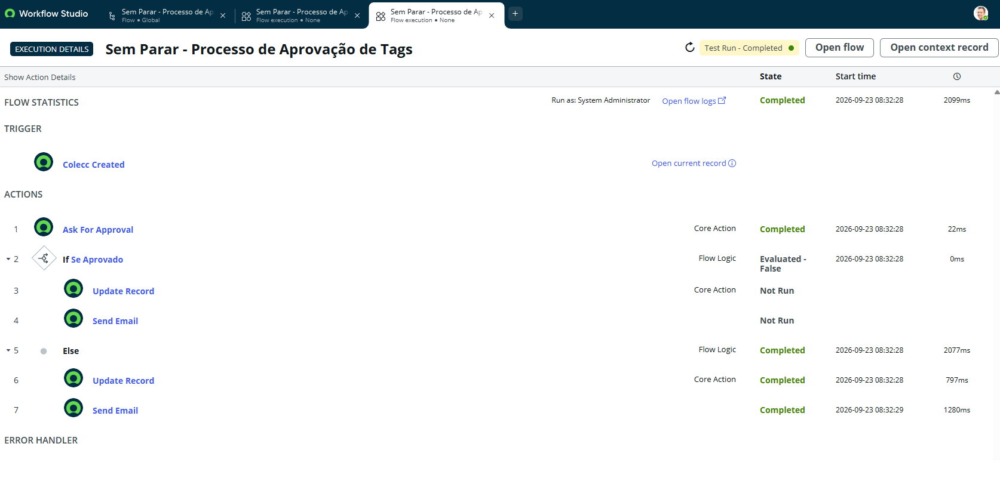

# 📘 Lab 02: Automação de Aprovação e Roteamento (Flow Designer)

## 🎯 Objetivo Técnico
Substituir processos manuais de triagem e aprovação por **Workflows Automatizados** utilizando o **Flow Designer**. Demonstrar proficiência no uso de gatilhos (*Triggers*), motores de decisão condicional (*If/Else*), uso de *Data Pills* e ações nativas do ServiceNow Core.

## 🏢 Cenário de Negócio
No Sem Parar Corpay, pedidos de Novas Tags Corporativas precisavam de auditoria e validação de despesas pelo gestor do frotista antes da liberação operacional. O trabalho era manual, moroso e suscetível a erros de comunicação. A solução desenhada orquestra a aprovação, o roteamento logístico e as notificações do início ao fim.

## 💡 Decisões Arquiteturais e Execução (Visão de Engenheiro)

1. **Abordagem No-Code (Flow Designer vs. Workflow):**
   * O uso do *Flow Designer* foi priorizado em detrimento da engine legada de *Workflows* em razão da sua maior escalabilidade, interface orientada a dados (*Data Pills*) e facilidade de sustentação. Todo o desenvolvimento foi versionado no Update Set `SemParar_FlowDesigner_TagApproval_v1`.

2. **Trigger Otimizado (Record Created):**
   * O fluxo é acionado de forma cirúrgica na tabela `incident` apenas quando a condição `Category is Infrastucture` é atingida, evitando execuções fantasmas no sistema.

3. **Orquestração de Ponta a Ponta:**
   * **Ask for Approval:** Direcionado dinamicamente via *Data Pill* (`Caller > Manager`).
   * **Fluxo Positivo (If Approved):** Atualiza a requisição para `In Progress`, faz a reatribuição ao grupo especialista ("Hardware/Fleet") e dispara e-mail de continuação para o solicitante.
   * **Fluxo Negativo (Else):** O status é forçado para `Closed Canceled` e um e-mail de justificativa de recusa é disparado imediatamente.

## 📸 Evidências do Laboratório Prático

> A execução do fluxo valida o caminho dos dados em tempo real (*Execution Details*), desde o gatilho até a decisão de aprovação e envio de e-mails.

**1. Arquitetura do Flow Designer (Motor Condicional e Aprovações):**

**2. Detalhes de Execução do Fluxo (Execution Context):**

